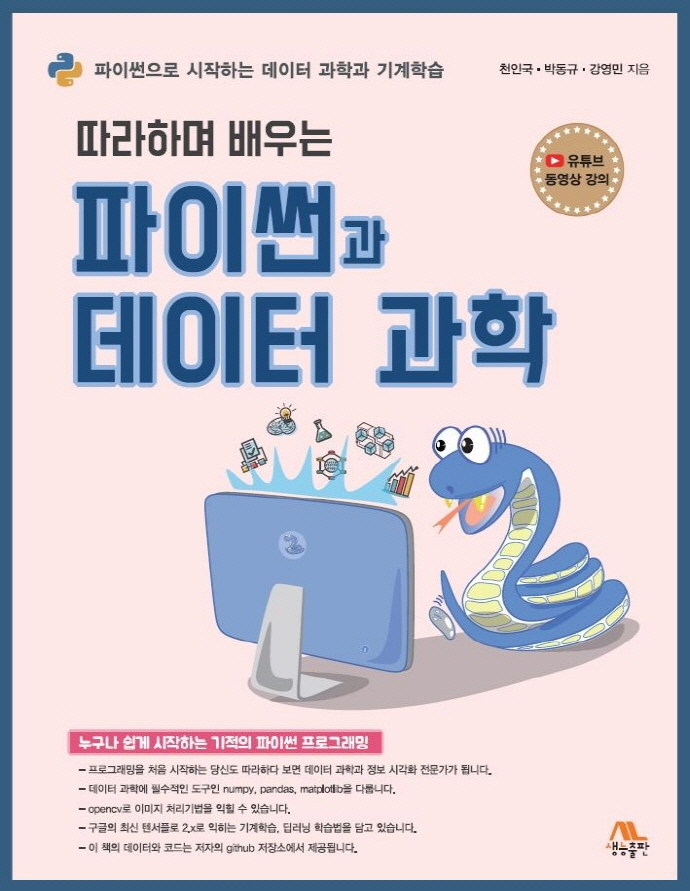
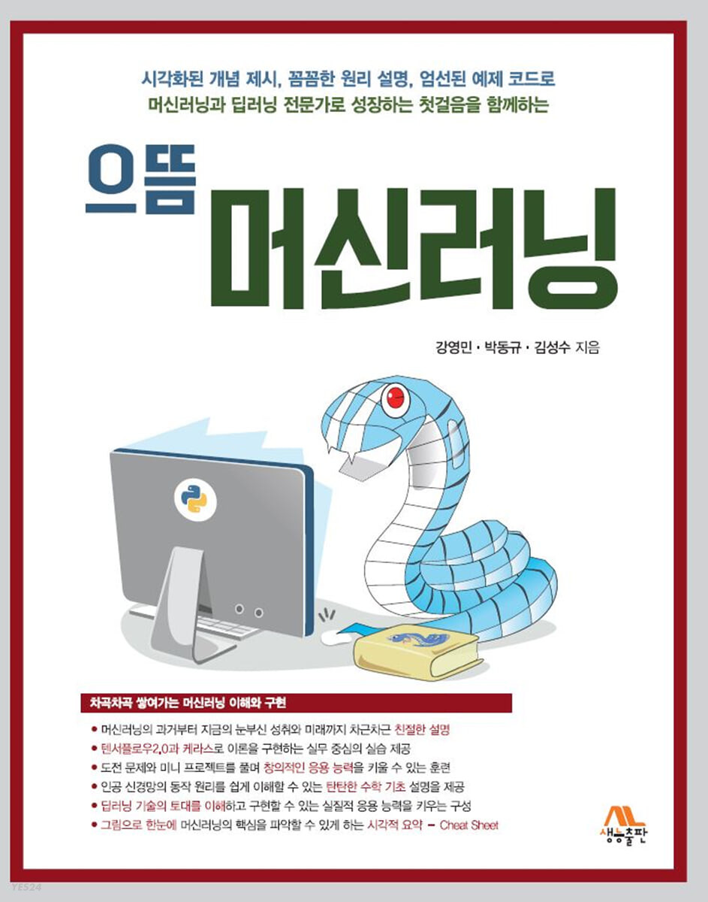

<p align="center">
  
</p>

# 한국출판문화산업진흥원의 **<2020년 세종도서 학술부문> 학술도서로** “으뜸 파이썬”이 선정되었습니다.
* [관련 언론 보도링크](https://www.asiae.co.kr/article/2020072816245298554)
* 온라인 구매 링크 : [[YES24]](http://www.yes24.com/Product/Goods/89140722), [[인터파크]](http://book.interpark.com/product/BookDisplay.do?_method=detail&sc.shopNo=0000400000&sc.prdNo=330274507&pis1=book&pis2=product), [[교보문고]](http://www.kyobobook.co.kr/product/detailViewKor.laf?ejkGb=KOR&mallGb=KOR&barcode=9788970503691&orderClick=LEa&Kc=)

***
# "으뜸 파이썬" 저장소 소개

안녕하세요 독자여러분 이곳은 생능출판사의 *"으뜸 파이썬"* 관련 저장소입니다.
이 책의 소스코드와 주피터 노트북 파일, colab 주소, 정오표등 다양한 자료와 정보를 업로드할 예정입니다.

"으뜸 파이썬"은 파이썬을 처음 배우는 입문자와 다른 프로그래밍 언어를 익힌 상태에서 새롭게 파이썬에 도전하는 개발자를 위한 책입니다.
이 책은 다음과 같은 특징이 있습니다.
#### 첫째, 파이썬의 기초를 익히고자 하는 초급자들이 쉽게 코딩의 원리를 이해하도록 돕기 위해 짧은 코드는 대화창에서 그 기능을 보여주며, 다소 긴 코드는 스크립트 파일로 제공합니다.
#### 둘째, 각 절의 마지막에는 LAB 문제를 넣어서 각 절에서 이해한 내용을 실습을 통해서 다시 확인할 수 있도록 하였습니다.
#### 셋째, 각 장의 마지막에는 단계별 연습문제를 제공하여, 한 번 더 본문의 내용과 관련된 문제를 해결하며 프로그래밍의 즐거움을 느낄 수 있도록 하였습니다.
#### 넷째, 파이썬의 고급 개발자로 발돋움 할 수 있는 고급 모듈과 예외처리, 람다함수, 리스트 축약표현 등의 기법과 그 원리를 그림으로 설명합니다.

- 책 미리보기는 다음 링크를 따라가 보세요 :
[으뜸 파이썬 미리보기](https://github.com/dongupak/Prime-Python/blob/master/preview.md)

***
# 책의 목차
* [목차](https://github.com/dongupak/Prime-Python/blob/master/contents.md)
: 으뜸 파이썬 책의 목차를 제공합니다.

# 책의 PDF(으뜸 파이썬 PDF(샘플)) - 5장 리스트 예시
* [으뜸 파이썬 PDF](https://github.com/dongupak/Prime-Python/blob/master/으뜸파이썬_샘플챕터.pdf)
: 으뜸 파이썬 책의 샘플 PDF 파일을 제공합니다.

# 이 책을 이용하여 강의를 하시는 분을 위한 강의 계획서
* [강의계획서 예시](https://github.com/dongupak/Prime-Python/blob/master/lecture.md)
: 강의에 활용하시는 강사님을 위한 강의소개, 강의목표, 주별 강의 계획서(15주 기준)를 제공합니다.
- 강사님을 위한 강의용 ppt 파일은 출판사 홈페이지를 통해 신청하실 수 있습니다.( http://www.booksr.co.kr/ )

## 시작하기

생능출판사의 "으뜸 파이썬"은 파이썬의 기초부터 고급 기능까지를 폭넓게 다루고 있는 책입니다.
이 책은 프로그램을 처음 접하는 입문자를 위한 파이썬 설치에서부터 고급 모듈, 예외처리, 람다함수, 리스트 축약표현과 넘파이까지 다루고있습니다.

### 함께 보면 좋은 책
책을 읽은 후 파이썬과 데이터 다루기, 머신러닝에 관련된 저자들의 책을 함께 보면 더 좋습니다. 

* (따라하며 배우는) 파이썬과 데이터 과학, 천인국, 박동규, 강영민, 생능출판사 (2020)
  * [[YES24]](http://www.yes24.com/Product/Goods/96555988), [[인터파크]](http://book.interpark.com/product/BookDisplay.do?_method=detail&sc.shopNo=0000400000&sc.prdNo=345271510&sc.saNo=003002001&bid1=search&bid2=product&bid3=title&bid4=001), [[교보문고]](http://www.kyobobook.co.kr/product/detailViewKor.laf?ejkGb=KOR&mallGb=KOR&barcode=9788970504773&orderClick=LEa&Kc=) 
* 으뜸 머신러닝, 강영민, 박동규, 김성수, 생능출판사 (2021)
  * [[YES24]](http://www.yes24.com/Product/Goods/102577953), [[인터파크]](http://book.interpark.com/product/BookDisplay.do?_method=detail&sc.shopNo=0000400000&sc.prdNo=352099030&sc.saNo=003002001&bid1=search&bid2=product&bid3=title&bid4=001), [[교보문고]](http://www.kyobobook.co.kr/product/detailViewKor.laf?ejkGb=KOR&mallGb=KOR&barcode=9788970504919&orderClick=LEa&Kc=)
<p align="center">
  
  
</p>

### 사전 지식

이 저장소의 코드를 실행하기 위해서는 다음 웹 사이트에 접속하여 파이썬 IDLE를 다운받아 설치하여야 합니다.
   * https://www.python.org/

혹은 다음의 구글 colab 웹사이트에 접속하여(구글 계정이 필요함) 노트북 환경에서 파이썬 코딩을 할 수 있습니다.
   * https://colab.research.google.com/

### 부록

분량상 이 책에서 다루지 못한 개발도구를 소개합니다. 파이썬 개발도구에 대한 자세한 설명은 아래 부록을 참고하세요.
* [으뜸 파이썬 부록 PDF](https://github.com/dongupak/Prime-Python/blob/master/부록.pdf)

# 강의 PPT
* 이 책으로 강의를 하실분을 위한 강의 PPT가 제공됩니다.
* 강의 PPT 자료 : https://booksr.co.kr/ 교수회원으로 로그인 후 강의자료 다운로드가 가능합니다.

## 수행하기
* 파이썬 코드는 파이썬 IDLE나 주피터 노트북이나 구글 colab등 다양한 환경에서 실행시킬 수 있습니다.
  * [구글 코랩 환경](https://drive.google.com/open?id=1j3gO8q_YwYH4ImcEN2AxhWbxaUiyfiMi)
: 웹상에서 책의 코드를 실행해 볼 수 있습니다(터틀 그래픽, tkinter, 파일입출력등 일부는 제외)
  * [주피터 노트북 파일](https://github.com/dongupak/Prime-Python/tree/master/jupyter-notebook)
: ipynb 확장자를 가지는 노트북 파일로 각 장별 코드가 제공됩니다.
  * [파이썬 소스코드](https://github.com/dongupak/Prime-Python/tree/master/src)
: py 확장자를 가지는 파이썬 파일로 각 장별 코드가 제공됩니다.

## "으뜸 파이썬" 정오표
* 이 책의 정오표는 다음 저장소를 보시기 바랍니다(책의 오류로 불편을 드린점 사과드립니다)
  * [정오표](https://github.com/dongupak/Prime-Python/tree/master/errata)

### 도움이 될만한 동영상 강좌
* 널널한 교수의 으뜸 파이썬 Youtube 강좌
  * https://www.youtube.com/playlist?list=PL2P1Vm9k53HOflCAdyYaOx7hfBHydWNcL
* 널널한 교수의 기초 파이썬 Youtube 강좌
  * https://www.youtube.com/watch?v=TK6RLGaM3Ao&list=PL2P1Vm9k53HOEn-QYXAfblQWkR0OW9mKX
* 널널한 교수의 고급 파이썬 Youtube 강좌
  * https://www.youtube.com/watch?v=HYg_Zp1186M&list=PL2P1Vm9k53HMUI3i_UKRfWc3ePzAVerhc
* "따라하며 배우는 파이썬과 데이터 과학(2020 출판)" Youtube 강좌
  * https://www.youtube.com/playlist?list=PL2P1Vm9k53HOD_lesbnzAS51t71QeOPms

***
## 기여하실 분

이 코드에 이상이 있거나 기여를 하실 분은 Fork후에 Request를 주시기 바랍니다.

## 버저닝

이 저장소는 으뜸 파이썬 1판의 저장소로 2판, 3판에 따라 각각 다른 버전이 나타날 수 있습니다.

## 저자
열린 마음으로 독자여러분의 의견을 받습니다. 책에 관련된 문의는 언제든 아래 이메일로 보내 주십시오.
* **박 동규** - *창원대학교 정보통신공학과 교수* 
  * [박동규교수 저장소](https://github.com/dongupak)
  * 이메일 : dongupak@gmail.com
* **강 영민** - *동명대학교 게임공학과 교수* 
  * [강영민교수 저장소](https://github.com/dknife)
  * 이메일 : young.min.kang@gmail.com

## 저작권
* 이 코드의 소유권은 모든 저자에게 있으나 비상업적 용도에 한해 자유롭게 이용가능하며 재배포 가능합니다.
* 출판물을 무단 복제하거나 저자의 허락없이 배포하는 것은 법에 위반되는 행위입니다.

# 책의 LAB과 연습문제 정답지 제공에 관하여
이 책에는 많은 도전 문제와 심화문제가 제공됩니다. 저자들이 모든 문제에 대해 답을 만들어 보았지만, 이것은 문제의 유효성을 검증하기 위한 것일 뿐입니다.  
이 책의 문제는 답이 제시되지 않은 문제의 해답을 찾는 과정과 실습을 통해 더 깊은 학습을 할 수 있도록 준비된 것입니다.
이에 저자는 정답지 제공을 하지 않음을 다시한번 알려드립니다.

***
## fork한 저장소를 최초 저장소의 내용과 일치시키는 방법
```
$ git remote add upstream https://github.com/dongupak/Prime-Python.git

$ git fetch upstream
remote: Enumerating objects: 91, done.
remote: Counting objects: 100% (91/91), done.
remote: Compressing objects: 100% (49/49), done.
remote: Total 78 (delta 41), reused 29 (delta 17), pack-reused 0
Unpacking objects: 100% (78/78), 19.00 KiB | 51.00 KiB/s, done.
From https://github.com/dongupak/Prime-Python
 * [new branch]      master     -> upstream/master

$ git rebase upstream/master
First, rewinding head to replay your work on top of it...
Fast-forwarded master to upstream/master.

$ git push origin master --force
Total 0 (delta 0), reused 0 (delta 0)
To https://github.com/dknife/Prime-Python.git
   3655ac5..ec4965d  master -> master

```
