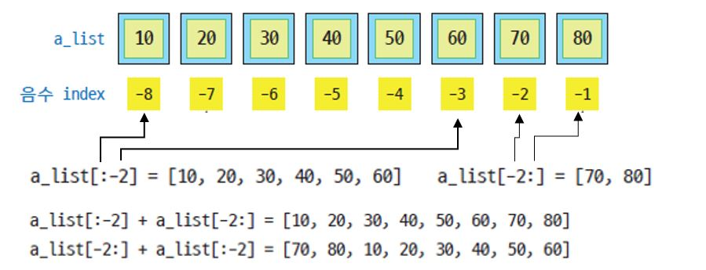

# "으뜸 파이썬" 정오표
## *책 내용에 있는 오류를 정리한 페이지 입니다. 불편을 끼쳐드려 대단히 죄송합니다. 다음 인쇄 때 수정하여 반영하겠습니다.*
## *책 증보판 발행시 소중한 기여자 분들의 id를 표기하여 감사의 마음을 표시하고자 합니다*
### *기여자(github id) : frea0227님, catmull님, dev-jhJoo님, 김미점님, 이선우님*
---

# 오류
### 잘못된 코드 오류, 실행 결과 오류, 잘못된 설명, 잘못된 참조 번호(그림, 코드 등) 

## 페이지 : 21
### 오탈자 : 밑에서 두 번 째 줄
<pre>
인터프리터 방식은 [그림 1-8]과 같이
</pre>
* 수정 후
<pre>
인터프리터 방식은 [그림 1-9]와 같이
</pre>

## 페이지 : 79
### 오탈자 : 가운데 문단 이진수 값
<pre>
1111010011(2)
</pre>
* 수정 후 : 최초의 1이 4개가 아닌 5개 입니다
<pre>
11111010011(2)
</pre>

## 페이지 : 105
### 오탈자 : 문제 2.4의 답 오류
<pre>
사각형의 면적 : 1800
</pre>
* 수정 후
<pre>
삼각형의 면적 : 400
</pre>

## 페이지 : 108
### 오탈자 : 문제 2.14의 답 오류
<pre>
...
9의 제곱근 = 2.8284271247461903
</pre>
* 수정 후
<pre>
...
9의 제곱근 = 3
</pre>

## 페이지 : 109
### 오탈자 : 제일 마지막줄 실행결과 
<pre>
90도 회전한 후 : (-0.1339745962155614+2.232050807568877j)
</pre>
* 수정 후
<pre>
30도 회전한 후 : (-0.1339745962155614+2.232050807568877j)
</pre>

## 페이지 : 111
### 오탈자 : 문제 2.20 첫번째 줄을 살펴보면 문제의 출제의도상 7이 아닌 6이 적합합니다.
<pre>
7은 0b111이며
</pre>
* 수정 후
<pre>
6은 0b110이며
</pre>

## 페이지 : 126
### 오탈자 : 코드 3-7
<pre>
if (number % 3) == 0 and (number % 3) == 0:
</pre>
* 수정 후 : 두번째 모듈로 연산자 뒤의 수가 5입니다.
<pre>
if (number % 3) == 0 and (number % 5) == 0:
</pre>

## 페이지 : 134
### 내용오류 : 밑에서 두 번째 줄, 예제와 설명이 다름
<pre>
2보다 1이 작지 않으므로 False를 반환한다.
</pre>
* 수정 후
<pre>
2와 1이 같지 않으므로 False를 반환한다.
</pre>

## 페이지 : 139
### 오탈자 : 가운데 부분
<pre>
점수가 70점 미만이고 60점 이상이면 'C' 등급
</pre>
* 수정 후
<pre>
점수가 70점 미만이고 60점 이상이면 'D' 등급
</pre>

## 페이지 : 179
### 오탈자 : 위에서 두 번째 줄 (제어변수명)
<pre>
이 문자열에서 한 글자씩 val에 대입하여 조건문을 돌게 된다.
</pre>
* 수정 후
<pre>
이 문자열에서 한 글자씩 ch에 대입하여 조건문을 돌게 된다.
</pre>

## 페이지 : 184
### 오탈자 : 문제와 그림 불일치 (문제 3.12)
<pre>
반지름 10인 원
원점과의 거리가 10보다 클 경우
10보다 작거나 같을 경우
</pre>
* 수정 후
<pre>
반지름 5인 원
원점과의 거리가 5보다 클 경우
5보다 작거나 같을 경우
</pre>

## 페이지 : 189
### 오탈자 : 문제 3.24의 마지막 문장 (1/3)의 3승이 아니라 2승
<pre>
(1/3)^3
</pre>
* 수정 후
<pre>
(1/3)^2
</pre>

## 페이지 : 193
### 오탈자 : 문제 3.31번 4번째 줄 .. 1에서 20,000 사이의로 수정
<pre>
... 1에서 200000 사이의 모든 친화수를 구해서 다음
</pre>
* 수정 후
<pre>
... 1에서 20,000 사이의 모든 친화수를 구해서 다음
</pre>

## 페이지 : 207
### 오탈자 : LAB 4-5번 문제 1번 둘째줄
<pre>
print_sum(10, 20)
</pre>
* 수정 후
<pre>
print_sub(10, 20)
</pre>

## 페이지 : 235
### 코드 오류 : 
<pre>
print('{}! = {}'.format(n, factorial(5)))
</pre>
* 수정 후
<pre>
print('{}! = {}'.format(n, factorial(n)))
</pre>

## 페이지 : 236
### 코드 오류 : 
<pre>
print('{}! = {}'.format(n, factorial(5)))
</pre>
* 수정 후
<pre>
print('{}! = {}'.format(n, factorial(n)))
</pre>

## 페이지 : 272, 연습문제 4.28
### 오타 수정
<pre>
(1) 또한 1/1! 에서
</pre>
* 정의에 따라 1/0! 이 추가되어야 함(0!은 1로 정의됨)
<pre>
(1) 또한 1/0! + 1/1! 에서
</pre>
이에 따라 아래 수행결과도 달라짐
<pre>
(1) euler( 5) = 2.70833
</pre>
1/0! + 1/1! + 1/2! + 1/3! + 1/4! + 1/5! 의 근사치 값이 2.71667임
<pre>
(1) euler( 5) = 2.71667
</pre>

## 페이지 : 279
### 대화창 실습1
<pre>
>>> n_list = [11, 22, 33, 44, 55, 66] # 6개의 요소를 가진 리스트
>>> n_list[5] # 리스트의 여섯 번째 요소 값
55
</pre>
* 수정내용 : n_list[5]의 출력결과는 마지막 요소 66입니다
<pre>
>>> n_list = [11, 22, 33, 44, 55, 66] # 6개의 요소를 가진 리스트
>>> n_list[5] # 리스트의 여섯 번째 요소 값
66
</pre>

## 페이지 : 290
### 오탈자 : [표 5-1] 리스트의 메소드와 하는 일 - sort()
<pre>
sort(): reverse 인자의 값이 False이면 내림차순으로 정렬한다.
</pre>
수정후 : False -> True
<pre>
sort(): reverse 인자의 값이 True이면 내림차순으로 정렬한다.
</pre>

## 페이지 : 296
### 잘못된 설명 : 리스트 추가가 아니라 통합임
<pre>
두 리스트 list1의 항목에 list2 항목을 추가하게 된다.
</pre>
수정후 : 
<pre>
리스트 list1과 list2를 통합한 새 리스트를 만든다.
</pre>

## 페이지 : 301
### 그림 번호 : 오류 (셋째 줄, 여섯째 줄)
<pre>
[그림 5-7]과 같이 원본 리스트
[그림 5-7]과 같이 end-1
</pre>
수정후 : 
<pre>
[그림 5-5]와 같이 원본 리스트
[그림 5-5]와 같이 end-1
</pre>

## 페이지 : 303
### 설명 수정 : [표 5-2] 마지막 두 개의 하는 일 수정
<pre>
a_list[::-1] 모든 항목을 가져오되 역순으로 슬라이싱
a_list[1::-1] 처음의 두 개 항목만 슬라이싱
</pre>
수정후 : 
<pre>
a_list[::-1] 모든 항목을 역순으로 가져옴
a_list[1::-1] 처음 두 개 항목을 역순으로 슬라이싱
</pre>

## 페이지 : 307
### [그림 5-14]의 화살표 오류

  
  
 화살표의 위치에서 발생한 오류(-7을 가리키는 화살표 부분)

* 수정내용 : 아래 그림과 같이 수정

  
  
 화살표의 위치를 수정한 내용(-8을 가리키도록 수정)

## 페이지 : 332
### 오탈자 : [표 6-3] 딕셔너리의 메소드와 하는 일에서 popitem()은 파이썬 3.6 이상에서는 마지막 키-값을 삭제합니다.
<pre>
popitem(): 랜덤하게 선택된 항목을 반환하고 그 항목을 삭제한다.
</pre>
수정후 : 
<pre>
popitem(): 마지막으로 입력된 항목을 반환하고 그 항목을 삭제한다.
</pre>

## 페이지 : 334
### 오탈자 : 아래에서 5번째 줄
<pre>
아래의 대화창 실습에서는 ('키', 179) 항목이
</pre>
수정후 : 
<pre>
아래의 대화창 실습에서는 ('몸무게', 82) 항목이
</pre>

## 페이지 : 337
### 오탈자 : 표 6-5의 오른쪽 두번째 행, 두번째 줄
<pre>
dic.pop(0) 호출 후
dic = {1:22, 2:33, 3:44, 4:55. 5:66}
</pre>
수정후 : 5:66 생략가능
<pre>
dic.pop(0) 호출 후
dic = {1:22, 2:33, 3:44, 4:55}
</pre>

## 페이지 : 338
### 오탈자 : 아래에서 4번째 줄
<pre>
그리고 list[1] 값을 출력해 보자.
</pre>
수정후 : 
<pre>
그리고 dic[1] 값을 출력해 보자.
</pre>

## 페이지 : 350
### 저자의 뒤늦은 깨달음
<pre>
[표 6-13]의 빈 집합 만들기에서 set0 = {}를 아래와 같이 정정합니다.
set0 = {}와 같이 할 경우 이 타입은 dict 타입이 되므로 아래와 같이 set() 객체를 생생해아 합니다.
</pre>
수정후 : 
<pre>
set0 = set()  
</pre>

## 페이지 : 352
### 오탈자 : [표 6-14] issubset(s), issuperset(s), isdisjoint(s) 설명에서 s 는 대상
<pre>
issubset(s): s 집합이 부분 집합인가를 구한다.
issuperset(s): s 집합이 상위 집합인가를 구한다.
isdisjoint(s): s 집합이 서로소인가를 구한다.
</pre>
수정후 : s 를 주체가 아닌 대상으로 변경
<pre>
issubset(s): s 집합의 부분 집합인가를 구한다.
issuperset(s): s 집합의 상위 집합인가를 구한다.
isdisjoint(s): s 집합과 서로소인가를 구한다.
</pre>

## 페이지 : 361
### 오탈자 : 네번째 줄 A x A x A 수식 부분의 오타로 (1, 3)이 튜플 자료형이므로 괄호를 제거해야함
<pre>
{(1, 3)}
</pre>
수정후 : 
<pre>
{1, 3}
</pre>

## 페이지 : 379
### 편집오류 : 연습문제 6.12 
<pre>
실행 결과의 내용이 문제 6.7의 내용으로 질문과 무관함
</pre>
수정후 : 아래와 같이 리스트 원소중 가장 큰 12가 제일 뒤쪽으로 이동 
<pre>
주어진 리스트는 =  [5, 6, 3, 9, 2, 12, 3, 8, 7]
가장 큰 수를 마지막으로 옮긴 결과:  [5, 3, 6, 2, 9, 3, 8, 7, 12]
</pre>

## 페이지 : 381
### 오탈자
<pre>
마을 A와 B에 보낼 투표용지의 개수는 각각 971 장과 1778 장입니다.
</pre>
수정후 : 
<pre>
마을 A와 B에 보낼 투표용지의 개수는 각각 971 장과 1698 장입니다.
</pre>

## 페이지 : 381
### 오탈자
<pre>
마을 A와 B의 고령화 정도는 각각 0.165와 0.035입니다.
</pre>
수정후 : 
<pre>
마을 A와 B의 고령화 정도는 각각 0.165와 0.003입니다.
</pre>

## 페이지 : 399
### 오탈자
<pre>
여기서는 다음 코드가 실행됟 때까지
</pre>
수정후 : 
<pre>
여기서는 다음 코드가 실행될 때까지
</pre>

## 페이지 : 404
### 오탈자 : 페이지 가장 아래에서 다섯번째 줄
<pre>
degree() 함수는 라디안을 각도 값으로 변환하는 함수이다.
</pre>
수정후 : degrees()로 수정
<pre>
degrees() 함수는 라디안을 각도 값으로 변환하는 함수이다.
</pre>

## 페이지 : 408
### 오탈자 : 가장 아래 줄 코드 번호 오류
<pre>
[코드 7-5]와 같은 의사 랜덤 함수를 만들어 보자
</pre>
수정후 : 7-5를 7-6으로
<pre>
[코드 7-6]과 같은 의사 랜덤 함수를 만들어 보자
</pre>

## 페이지 : 409
### 오탈자 : 가장 윗줄 코드 번호 오류
<pre>
[코드 7-5]와 같이 의사 랜덤 함수 pseudo_rand()의
</pre>
수정후 : 7-5를 7-6으로
<pre>
[코드 7-6]과 같이 의사 랜덤 함수 pseudo_rand()의
</pre>

## 페이지 : 415
### 아래에서 4번째 줄 방향 표시 오류
<pre>
100 픽셀 왼쪽으로 이동하며
</pre>
수정후 : 
<pre>
100 픽셀 오른쪽으로 이동하며
</pre>

## 페이지 : 433
### 오탈자 : 위에서 첫 번째 줄
<pre>
터틀 그래픽을 이용하여 앞서 배운 [코드 7-22]를 [코드 7-23]과 같이 수정해 보자.
</pre>
수정후 : [코드 7-22] -> [코드 7-10]
<pre>
터틀 그래픽을 이용하여 앞서 배운 [코드 7-10]을 [코드 7-23]과 같이 수정해 보자.
</pre>

## 페이지 : 440
### 오류 : 두번째 대화창 실습 제목 오류
<pre>
대화창 실습 : sys 모듈을 이용한 파이썬 버전과 경로, 저작권
대화창 실습 : sys 모듈을 이용한 파이썬 버전과 경로, 저작권
</pre>
수정후 : 두 번째 대화창 실습 제목 수정
<pre>
대화창 실습 : sys 모듈을 이용한 파이썬 버전과 경로, 저작권
대화창 실습 : sys 모듈을 이용한 경로 설정 확인
</pre>

## 페이지 : 444
### 코드 번호 오류 
<pre>
다음으로 [코드 7-27]과 같이 레이블과 버튼, 그리고 버튼에 마우스 클릭 이벤트가 발생했을 경우 화면상의 레이블 텍스트와 배경 색상을 변경시키는 코드를 살펴보자.
이 코드는 앞서 살펴본 [코드 7-2]와 같이 1) tkinter라는 모듈 내에서 ...
하지만 이전과 달리 버튼 객체에 ...
</pre>
수정후 : 
<pre>
다음으로 레이블과 버튼, 그리고 버튼에 마우스 클릭 이벤트가 발생했을 경우 화면상의 레이블 텍스트와 배경 색상을 변경시키는 [코드 7-27]을 살펴보자.
이 코드는 1) tkinter라는 모듈 내에서 ...
이 코드는 ...
</pre>

### 오탈자 : 7.8.2절 위로 둘째 줄
<pre>
change_labe() 함수가
</pre>
수정후 : labe() 오자 수정
<pre>
change_label() 함수가
</pre>

## 페이지 : 449
### 오탈자 : 아래에서 네번째 줄
<pre>
[그림 7-30]을 참조하면,
</pre>
수정후 : 
<pre>
[그림 7-32]를 참조하면,
</pre>

## 페이지 : 455
### 오탈자 : 코드 내 indentation 오류와 잘못된 공백
res_label .xxx 로 표현된 모든 줄을 res_label.xxx 로 수정해야 함
<pre>
def subtract():
    res_text = "...
   res_label .configure(...
</pre>
수정후 : 
<pre>
def subtract():
    res_text = "...
    res_label .configure(...
</pre>

## 페이지 : 476
### 오탈자 : 코드 8-3 위
<pre>
연산자 +를 정수와 실수 자료형에
</pre>
수정후 : "실수"를 "문자열"로 수정
<pre>
연산자 +를 정수와 문자열 자료형에
</pre>

## 페이지 : 486
### 오류 : 실행 결과 아래 오류 종류 변경
<pre>
때문에 TypeError 예외가 발생되어
</pre>
수정후 : 
<pre>
때문에 ValueError 예외가 발생하여
</pre>

## 페이지 : 495
### 오류: 코드 8-14에서 rstrip 함수 설명 수정
<pre>
# 'AAA' 줄을 읽고 오른쪽 줄 바꿈 문자를 지움
# 'BBB' 줄을 읽고 오른쪽 줄 바꿈 문자를 지움
</pre>
수정후 : 
<pre>
# 'AAA' 줄을 읽고 오른쪽에 있는 모든 공백문자를 지움
# 'BBB' 줄을 읽고 오른쪽에 있는 모든 공백문자를 지움
</pre>

## 페이지 : 496
### 오류: open 함수 모드 설명 오류
<pre>
a는 추가(append)모드이며, +는 기존 파일이 없을 경우 새롭게 파일을 생성하는 모드이다.
</pre>
수정후 : 
<pre>
a는 추가(append)모드이며, +는 추가뿐만 아니라 읽기도 가능하게 만든다.
</pre>

## 페이지 : 505
### 오류: open 함수 사용 오류
<pre>
f.open() 함수에서 파일 열기가 실패하면 f.write() 작업은 오류가
</pre>
수정후 : 
<pre>
open() 함수에서 파일 열기가 실패하면 f.write() 작업은 오류가
</pre>

## 페이지 : 507
### 문맥이상 : 마지막 문단
<pre>
이 코드의 파일 읽기에서 try 절은 with 문을 이용하여 파일 읽기를 시도한다.
</pre>
수정후 : 바로 위의 코드 8-23은 try-except 문을 사용한 예제로 이 코드에 대한 설명에 with 문을 이용한다는 표현이 맞지 않음.
<pre>
이 코드의 파일 읽기에서 try 절은 open() 문을 이용하여 파일 읽기를 시도한다.
</pre>

## 페이지 : 511
### 오탈자 : 연습문제 1번 (4)
<pre>
buf = readline(in_file)
</pre>
수정후 : 
<pre>
buf = in_file.readline()
</pre>

## 페이지 : 565
### 오탈자 : 동작(메소드) 표
<pre>
amount 만큼의 돈을 balance에 추가함
</pre>
수정후 : 
<pre>
money 만큼의 돈을 balance에 추가함
</pre>

## 페이지 : 565
### 오탈자 : 동작(메소드) 표
<pre>
amount 만큼의 돈이 balance에서 빠져나감. 만일 amount가 money보다 작으면
</pre>
수정후 : 
<pre>
money 만큼의 돈이 balance에서 빠져나감. 만일 balance가 money보다 작으면
</pre>

## 페이지 : 568
### 오류: __init__와 set_channel, set_volume의 하는 일 수정
<pre>
__init()__ : 디폴트 볼륨 값은 5, 디폴트 채널 값은 0 값을 가지면 꺼짐 상태가 기본 상태
set_channel() : 채널 값...
set_volume() : 볼륨 값...
</pre>
수정후 : 
<pre>
__init()__ : 디폴트 볼륨 값은 5, 디폴트 채널 값은 0 값을 가지며, 꺼짐 상태로 설정
set_channel() : 인자를 받아 이 값으로 채널을 설정하는 메소드. 이때 인자가 0에서 201사이의 값이 아닐 경우 "채널 오류"를 출력함
set_volume() : 인자를 받아 이 값으로 볼륨을 설정하는 메소드. 이때 인자가 0에서 201사이의 값이 아닐 경우 "볼륨 오류"를 출력함
</pre>

## 페이지 : 570
### 오탈자 : 문제 9.13 사각형 이미지의 레이블 오류
<pre>
회색 사각형의 r1
</pre>
수정후 : 회색 r1 사각형을 r2로 수정(총 3건)
<pre>
회색 사각형 영역 레이블은 r2
</pre>

## 페이지 : 571
### 오탈자 : [문제 9.14] 속성 테이블 내부 오타
<pre>
중심좌표의 x값
</pre>
수정후 : 
<pre>
중심좌표의 y값
</pre>

## 페이지 : 587
### 오탈자 : 노트내의 문장에 불필요한 단어
<pre>
이름과 이 메모리 공간의 할당이 필요하지만
</pre>
수정후 : 
<pre>
이름과 메모리 공간의 할당이 필요하지만
</pre>

## 페이지 : 600
### 오탈자 : [그림 10-9]에서 next() 함수 반환 값이 10으로 동일함, 상자의 수를 수정해야 함
<pre>
10 10 10
</pre>
수정후 : 
<pre>
10 20 30 으로 수정
</pre>

## 페이지 : 610
### 오탈자 : 가장 아래쪽 문단의 다음 내용을 수정해야 함
<pre>
list() 함수는 내장함수로서 문자열을 리스트로 변환할 때 사용한다.
</pre>
수정후 : 
<pre>
list() 함수는 내장함수로서 문자열 등의 반복가능객체를 리스트로 변환할 때 사용한다.
</pre>

## 페이지 : 627
### 코드 오류 : 소수를 리스트 형식으로 반환하는 예제 함수가 완벽하지 않음
### (이때문에 실행결과에 16, 32가 나타나는 오류가 있음)
<pre>
def is_prime(n):
    if n==2 or n==3: return True # 2 혹은 3은 소수임
    for i in range(3, n, 2):     # 홀수에 대해서만 나누기 검사 수행
</pre>
수정후 : 다음과 같아 if n % 2 == 0: 검사 모듈을 추가함
<pre>
def is_prime(n):
    if n == 2 or n == 3: return True # 2 혹은 3은 소수임
    if n % 2 == 0: return False  # 그렇지 않을 경우 짝수인지 검사하여 짝수이면 False를 반환함
    for i in range(3, n, 2):     # 홀수에 대해서만 나누기 검사 수행
</pre>

## 페이지 : 643
### 오탈자 : 위에서 2번째 줄, "주의" 상자의 zeors 오타가 3개 있습니다.
<pre>
zeors((n,m))
</pre>
수정후 : 아래와 같이 3군데에 걸쳐 zeros로 수정 (위에서 2번째 줄에 한 개, 주의 상자의 첫 줄에 두 개)
<pre>
zeros((n,m))
</pre>

## 페이지 : 645
### 오탈자 : 밑에서 네번째 줄 오타
<pre>
0.0, 0.25, 5.0,
</pre>
수정후 : 0.25를 2.5로 수정
<pre>
0.0, 2.5, 5.0,
</pre>

## 페이지 : 647
### 오탈자 : [그림 11-9] arrange 오타 수정
<pre>
arrange(0, 10).reshape(2, 5)
</pre>
수정후 : 다음과 같이 arange(0, 10)으로 수정
<pre>
arange(0, 10).reshape(2, 5)
</pre>

## 페이지 : 673페이지 연습문제 11.15의 실행결과 오류
### 오탈자 : (2)번 실행결과
<pre>
행렬의 모든 원소의 합 : 10
</pre>
수정후 : 
<pre>
행렬의 모든 원소의 합 : 15
</pre>
### 오탈자 : (3)번 실행결과
<pre>
[4 3 2 1 0]
</pre>
수정후 : 
<pre>
[5 4 3 2 1]
</pre>
### 오탈자 : (4)번 실행결과
<pre>
[0 1 2 3 4]
</pre>
수정후 : 
<pre>
[1 2 3 4 5]
</pre>

-------------

# 다듬어야 할 내용
### 프로그래밍 자체의 문제나 잘못된 설명은 아니지만 문법에 맞지 않거나, 어색한 표현, 오탈자 등의 고쳐야 할 내용
### 모든 코드에서 쉼표 뒤에는 공백이 존재하도록 할 것 open(fname,"wt") -> open(fname, "wt")
### 전체 코드에서 문자열은 기본적으로 작은따옴표를 사용하는 원칙을 준수할 것
### 버튼을 버턴으로 표기한 경우가 몇 군데 있음

## 페이지 : 53
### 오탈자 : 밑에서 다섯 번째 줄
<pre>
바뀔 때만다
</pre>
* 수정 후 
<pre>
바뀔 때마다
</pre>

## 페이지 : 59
### 혼동 가능한 표현 제거 (식별자 규칙, 표 2-2의 마지막 식별자)
<pre>
1. 영문자와 숫자
3. 첫 글자는 반드시 영문자나
[표 2-2]의 "숫자변수: 유니코드 문자인 한글 문자도 변수로 사용 가능"
</pre>
* 수정 후 
<pre>
1. 문자와 숫자
3. 첫 글자는 반드시 문자나
[표 2-2] "높이: 유니코드 문자인 한글 문자도 변수로 사용 가능"
</pre>

## 페이지 : 75
### 오탈자 : 가운데 문단
<pre>
여러 줄의 문자열을 저장하기 표현하기 위해서는 \n 문자를 삽입한다.
</pre>
* 수정 후
<pre>
여러 줄의 문자열을 표현하기 위해서는 \n 문자를 삽입한다.
</pre>

## 페이지 : 88
### 오탈자 : 위에서 두 번째 줄
<pre>
이렇게 True나 False의 값을 갖는 자료형을 부울형(bool) 형이라고 한다.
</pre>
* 수정 후
<pre>
이렇게 True나 False의 값을 갖는 자료형을 부울(bool) 형이라고 한다.
</pre>

## 페이지 : 95
### 설명 명확화: 위에서 여섯째 줄
<pre>
이것은 10진수 10의 보수표현 값으로 전체값은 10진수 -10으로 해석된다.
</pre>
* 수정 후
<pre>
이것은 10진수 10을 2의 보수로 표현한 것으로, 음수 비트와 함께 전체값은 10진수 -10으로 해석된다.
</pre>

## 페이지 : 127
### 어색한 설명 수정
<pre>
앞에서 익힌 if 문을 통해 이러한 상황을 처리하는 프로그램을
</pre>
* 수정 후 :
<pre>
앞에서 익힌 if 문을 통해 아래의 상황 3을 처리하는 프로그램을
</pre>

## 페이지 : 137
### 윤년 규칙 설명 다듬기
<pre>
1) 연수가 4로 나누어 떨어지는 해는 윤년으로 한다
2) 연수가 4와 100으로 모두 나누어 떨어지는 해는 평년으로 한다
3) 연수가 400으로 나누어 떨어지는 해는 윤년으로 한다
</pre>
* 수정 후 : 각 규칙은 앞선 규칙의 예외임을 명시
<pre>
1) 연수가 4로 나누어 떨어지는 해는 윤년으로 한다
2) 연수가 1의 조건에 만족함에도 100으로 나누어 떨어지는 해는 평년으로 한다
3) 연수가 2의 조건에 만족함에도 400으로 나누어 떨어지는 해는 윤년으로 한다

</pre>

## 페이지 : 150
### 오탈자 : 위에서 두 번째 문단
<pre>
양수 간격 값을 사용할 때는 ..., 음수 간격 값을 생성할 때는 ...
</pre>
* 수정 후 : 다음과 같이 수정하는 것이 더욱 더 자연스러운 문장입니다.
<pre>
양수 간격 값을 사용할 때는 ..., 음수 간격 값을 사용할 때는 ...
</pre>

## 페이지 : 192
### 오탈자 : 중복표선 삭제 (문제 3.30의 마지막 문장)
<pre>
또한, 각 연산에 배정된 숫자가 아닌, 다른 숫자를 입력하면 잘못 입력하였다는 정보를 출력하여야 한다.
</pre>
* 수정 후: 삭제
<pre>

</pre>

## 페이지 : 193
### 오탈자 : 누락된 표현 추가 (문제 3.31의 4행)
<pre>
1, 2, 3, 71, 142를 220이 된다.
</pre>
* 수정 후
<pre>
1, 2, 3, 71, 142를 모두 더하면 220이 된다.
</pre>

## 페이지 : 202
### 오탈자 : 위에서 세 번째 줄, 아래에서 네 번째 줄, 
<pre>
이 때분에
명령문어들의 집합
</pre>
* 수정 후
<pre>
이 때문에
명령문들의 집합
</pre>

## 페이지 : 214
### 오탈자/내용어색 : [코드 4-13]
<pre>
# 함수 호출시 인자를 상수 값을 사용함
# result1, result2를 이용해서 결과 값을 반환 받아온다.
</pre>
* 수정 후
<pre>
# 함수 호출시 1, 2, -8 인자를 사용함
# result1, result2를 이용해서 결과 값을 반환받는다.
</pre>

## 페이지 : 214
### 오탈자 : 위에서 세 번째 줄
<pre>
함수 외부에서는 함수 get_root를 호출에
</pre>
* 수정 후
<pre>
함수 외부에서는 함수 get_root를 호출하여
</pre>

## 페이지 : 218
### 오탈자 : 그림 캡션 변경
<pre>
그리고 이 지역변수를 사용하는 print_sum()
</pre>
* 수정 후
<pre>
그리고 지역변수를 사용하는 print_sum()
</pre>

## 페이지 : 225
### 내용어색 : [코드 4-22]
<pre>
# 함수 호출시 인자를 상수 값을 사용함
# result1, result2를 이용해서 결과 값을 반환 받아온다.
</pre>
* 수정 후
<pre>
# 함수 호출시 1, 2, -8 인자를 사용함
# result1, result2를 이용해서 결과 값을 반환받는다.
</pre>

## 페이지 : 238
### 내용오류 : 불필요한 구절 삭제 (8번째 줄)
<pre>
input() 함수를 사용하면 대화창에서는 'Enter your name : '이라는 문자열이 나타나며 사용자가 입력할 수 있도록 대기한다.
</pre>
<pre>
input() 함수를 사용하면 사용자가 입력할 수 있도록 대기한다.
</pre>

## 페이지 : 238
### 내용오류 : 실행결과
<pre>
Enter your name : Hong GilDong 
Hello Hong GilDong !
</pre>
* 다음과 같이 이름을 입력하는 부분이 줄바꿈 아래에 나타남
<pre>
Enter your name : 
Hong GilDong 
Hello Hong GilDong !
</pre>

## 페이지 : 243
### 내용어색 : NOTE : 함수와 메소드 (매개변수 -> 인자, 자신을 가지는  -> 자신을 가지고 있는 객체)
<pre>
그런데, 함수는 호출하여 매개변수를 전달하여 ...
이 메소드는 자신을 가지는 객체의 속성 혹은 멤버 변수들에 대해 접근할 수 있다.
</pre>
* 수정 후
<pre>
그런데, 함수는 호출하여 인자를 전달하여 ...
이 메소드는 자신을 가지고 있는 객체의 속성 혹은 멤버 변수들에 대해 접근할 수 있다.
</pre>

## 페이지 : 241
### 잘못된 언급 삭제 (위에서 두번째 줄)
<pre>
앞에서 배운 split() 메소드를 이용하여
</pre>
* 수정 후
<pre>
split() 메소드를 이용하여
</pre>

## 페이지 : 242
### 오탈자 : (구문 -> 구분) 아래에서 여섯 번째 줄, 세 번째 줄 
<pre>
split() 메소드는 문자열 객체를 구문 문자열을 이용하여 ...
아무런 인자가 없을 경우 공백 문자가 구문자 역할을 하기 때문에 ...
</pre>
* 수정 후
<pre>
split() 메소드는 문자열 객체를 구분 문자열을 이용하여 ...
아무런 인자가 없을 경우 공백 문자가 구분자 역할을 하기 때문에 ...
</pre>

## 페이지 : 244 ~ 246
### 오탈자 : 대화창 실습의 제목
<pre>
플레이스홀드
</pre>
* 수정내용 : 플레이스홀드 -> 플레이스홀더
<pre>
플레이스홀더
</pre>

## 페이지 : 248
### 내용 누락 : 아래에서 네 번째 줄
<pre>
앞서 배운 % 서식에서 사용한 것과 같이 출력의 크기와 형식을 지정해 줄 수 있다.
</pre>
* 수정내용 : % 서식 언급 제거
<pre>
출력의 크기와 형식을 지정해 줄 수 있다.
</pre>

## 페이지 : 251
### 잘못된 연결 : 참고할 부록이 없음 (아래에서 두 번째 문단)
<pre>
format()을 이용한 출력 방법 이외에도 %를 이용한 다양한 출력 포매팅이 가능하다.
이에 관한 내용은 부록을 참고하기 바란다.
</pre>
* 수정내용 : 부록 참고 안내 제거 또는 부록 추가
<pre>
format()을 이용한 출력 방법 이외에도 %를 이용한 다양한 출력 포매팅이 가능하다.
</pre>

## 페이지 : 252
### 설명 다듬기 (밑에서 두번째 줄)
<pre>
동일한 문자가 문자열에서 어디에서 있는지 그 인덱스를 반환해주므로
</pre>
<pre>
동일한 문자가 문자열의 어디에 있는지 찾아 그 첫번째 인덱스를 반환해주므로
</pre>

## 페이지 : 256
### 불필요한 표현 삭제 (밑에서 셋째 줄)
<pre>
위에서 사용한 내장함수들 중에서
</pre>
* 수정내용 : 
<pre>
내장함수들 중에서
</pre>

## 페이지 : 266
### 힌트 1 코드의 출력문이 문제와 불일치 (문제 4.16)
<pre>
쉼표로 구문된 정수를 임의의 개수 입력하시오:
</pre>
<pre>
쉼표로 구문된 정수를 여러 개 입력하시오:
</pre>

## 페이지 : 278
### 오탈자 : 대화창 실습의 주석
<pre>
>>> n_list[1]    # 리스트의 두 번째 항목의 인덱스는 0이다. 
</pre>
* 수정내용 : 주석문을 다음과 같이 수정
<pre>
>>> n_list[1]    # 리스트의 두 번째 항목의 인덱스는 1이다. 
</pre>

### 대화창 실습2
<pre>
>>> n_list = [11, 22, 33, 44, 55, 66]>>> n_list[-1]    # 리스트의 마지막 요소 값 
</pre>
* 수정내용 : 66]과 >>> 사이에 줄바꿈이 있습니다
<pre>
>>> n_list = [11, 22, 33, 44, 55, 66]
>>> n_list[-1]    # 리스트의 마지막 요소 값 
</pre>

## 페이지 : 283
### 오탈자 : 밑에서 6번 째 줄
<pre>
가정 먼저 나타나는 44를
</pre>
수정후 : 가정 -> 가장
<pre>
가장 먼저 나타나는 44를
</pre>

## 페이지 : 292
### 오탈자 : 위에서 4번째 줄
<pre>
와 리스틀 얻을 수 있다.
</pre>
수정후
<pre>
의 리스트를 얻을 수 있다.
</pre>

## 페이지 : 342
### 오탈자 : 주의 상자 첫번째 줄
<pre>
튜플 생성시에 하나의 항목만 갖는 튜프를 생성하겠다고
</pre>
수정후 : 
<pre>
튜플 생성시에 하나의 항목만 갖는 튜플을 생성하겠다고
</pre>

## 페이지 : 354
### 편집오류 : s1 n s2에서 n이 아닌 교집합 기호(∩)를 사용해야 함
<pre>
(s1 ∪ s2) - (s1 n s2) 연산
</pre>
수정후 : 
<pre>
(s1 ∪ s2) - (s1 ∩ s2) 연산
</pre>

## 페이지 : 362
### 오탈자 : 대화창이 아닌 코드 실습입니다
<pre>
대화창 실습을 통해 이러한 확인해 보자. 아래의 대화창 실습에서 cases는 주사위를 던져서 나올 수 있는 눈의 모든 경우를 보여주고 있다.
</pre>
수정후 : 
<pre>
프로그램 실습을 통해 이러한 내용을 확인해 보자. 아래의 [코드 6-9]에서 cases는 주사위를 던져서 나올 수 있는 눈의 모든 경우를 보여주고 있다.
</pre>

## 페이지 : 367
### 오탈자 : 중복된 동사 제거
<pre>
곱집합을 이용하여 구하여 주사위를 여러 번 던져서 특정한 수 이상의 합을 얻을 확률을
</pre>
수정후 : 
<pre>
곱집합을 이용하여 주사위를 여러 번 던져서 특정한 수 이상의 합을 얻을 확률을
</pre>

## 페이지 : 367
### 오탈자 : Lab 번호 [ ] 안에 담기
<pre>
LAB 6-12로 연습해 보자
</pre>
수정후 : 
<pre>
[LAB 6-12]로 연습해 보자
</pre>

## 페이지 : 378
### 연습문제 6.11 : 문제가 명확하지 않음(차후에 더욱더 명확하게 하겠습니다)
문제가 명확하지 않아 다음과 같이 수정합니다.
<pre>
6.11 다음과 같은 리스트에는 원소를 가지는 항목과 원소를 가지지 않는 빈 튜플, 빈 문자열, 빈 리스트가 존재한다. 
이 리스트에서 빈 튜플과 빈 문자열, 빈 리스트만을 제거한 결과를 출력하는 코드를 작성하라. 
단 ((),) 튜플은 빈 튜플이 하나 있는 튜플로 간주하여 제거하지 않는다.
[실행결과]
주어진 리스트 : [(), (1,), [], 'abc', (), (), (1,), ('a',), ('a', 'b'), ((),), '']
빈 원소를 제거한 결과 : [(1,), 'abc', (1,), ('a',), ('a', 'b'), ((),)]
</pre>

## 페이지 : 379
### 편집오류
<pre>
(힌트: sorted() 함수나. 리스트의 sort()
</pre>
수정후 : 마침표가 아닌 쉼표
<pre>
(힌트: sorted() 함수나, 리스트의 sort()
</pre>

## 페이지 : 383
### 기여자님의 의견
<pre>
학생들의 수학과 과학 성적의 평균은 90.62입니다.
</pre>
의견 : 소수점 아래 둘째 자리까지 출력할 수도 있으나 디폴트 출력의 경우 세자리가 출력됩니다.
<pre>
print('학생들의 수학과 과학 성적의 평균은 {0:5.2f}입니다.'.format(result)) 
와 같이 출력할 경우 책의 결과와 같으며
print('학생들의 수학과 과학 성적의 평균은 {}입니다.'.format(result)) 
와 같이 출력할 경우 아래 결과와 같습니다.
</pre>
<pre>
학생들의 수학과 과학 성적의 평균은 90.625입니다.
</pre>

## 페이지 : 385
### 불필요한 조사 (밑에서 세 번째 줄)
<pre>
그리고 이 인덱스에 0과 1에 해당되는
</pre>
수정후: 조사 삭제
<pre>
그리고 이 인덱스 0과 1에 해당되는
</pre>

## 페이지 : 394
### 오탈자
<pre>
ex3) import turtle as t
</pre>
수정후 : 아래와 같이 ex3이 아닌 ex4 입니다
<pre>
ex4) import turtle as t
</pre>

## 페이지 : 399
### 오탈자
<pre>
여기서는 다음 코드가 실행됟 때까지
</pre>
수정후 : 
<pre>
여기서는 다음 코드가 실행될 때까지
</pre>

## 페이지 : 400
### 오자
<pre>
0.0008초 밖에 걸리진 않으며 컴퓨터는 매우 빠르게 연산을
</pre>
수정후 : 
<pre>
0.0008초 밖에 걸리지 않으며 매우 빠르게 연산을 
</pre>

## 페이지 : 407
### 오탈자 : 가운대 대화창 실습 주석 2줄
<pre>
# 리스트의 원소를 중에서 랜덤하게 하나를 고른다
# 리스트의 원소를 중에서 랜덤하게 세개를 고른다
</pre>
수정후 : 를 -> 들
<pre>
# 리스트의 원소들 중에서 랜덤하게 하나를 고른다
# 리스트의 원소들 중에서 랜덤하게 세개를 고른다
</pre>

## 페이지 : 414
### 군말 제거
<pre>
이와 같이 터틀 그래픽은 파이썬 대화창에서도 수행할 수 있다.
</pre>
수정후 : 
<pre>
터틀 그래픽은 파이썬 대화창에서도 수행할 수 있다.
</pre>

## 페이지 : 419
### 오탈자 : 아래에서 네번째 줄
<pre>
done() 명령어 이 프로그램을 이벤트 루프
</pre>
수정후 : 조사 "~는"이 빠졌습니다.
<pre>
done() 명령어는 이 프로그램을 이벤트 루프
</pre>

## 페이지 : 426
### 오탈자 : 제일 아래 문장의 제일 아래 줄
<pre>
이 프로그램이 [코드 7-18]에 나타나 있다.
</pre>
수정후 : 
<pre>
이 프로그램이 [코드 7-19]에 나타나 있다.
</pre>

## 페이지 : 450
### 오탈자 : 위에서 두번째 줄
<pre>
우리가 사용할 메소드는 이 레이블들은 위치를 설정하는 grid 메소드이다.
</pre>
수정후 : "레이블들"의 조사 "은"을 "~의"로 수정
<pre>
우리가 사용할 메소드는 이 레이블들의 위치를 설정하는 grid 메소드이다.
</pre>

## 페이지 : 450
### 오탈자 : 아래에서 8번째 줄
<pre>
그리고 두 Etry 객체의 위치 역시
</pre>
수정후 : 
<pre>
그리고 두 Entry 객체의 위치 역시
</pre>

## 페이지 : 452
### 오탈자 : 코드의 grid 설정에서 column 번호 변경
<pre>
btn_plus.grid(column = 4, row = 1)
btn_minus.grid(column = 5, row = 1)
btn_mult.grid(column = 6, row = 1)
btn_div.grid(column = 7, row = 1)
</pre>
수정후 : 
<pre>
btn_plus.grid(column = 2, row = 1)
btn_minus.grid(column = 3, row = 1)
btn_mult.grid(column = 4, row = 1)
btn_div.grid(column = 6, row = 1)
</pre>

## 페이지 : 453
### 오탈자 : 위에서 7번째 줄
<pre>
우선 더하기 동작을 살펴보자. 더하긱 동작은
</pre>
수정후 : 더하긱 -> 더하기
<pre>
우선 더하기 동작을 살펴보자. 더하기 동작은
</pre>

## 페이지 : 470
### 오탈자 : 아래에서 6번째 줄
<pre>
오류의 종류로는 위의 그림과 같은 오류이외에도
</pre>
수정후 : 띄어쓰기
<pre>
오류의 종류로는 위의 그림과 같은 오류 이외에도
</pre>

## 페이지 : 484
### 오탈자 : 두 번째 문단 두 번째 줄
<pre>
위 코드의 실행시켜 보면
</pre>
수정후 : "의"를 "를"로 수정
<pre>
위 코드를 실행시켜 보면
</pre>

## 페이지 : 490
### 보완 : x 모드에 대한 설명 보완
<pre>
이 모드는 a과 달리 파일이 있을 경우
</pre>
수정후 : 
<pre>
이 모드는 a나 w와 달리 파일이 있을 
</pre>

## 페이지 : 495
### 오탈자 : 마지막 문단
<pre>
마지막에 나오는 문자를 삭제할 수 있다
</pre>
수정후 : 마침표(.) 누락
<pre>
마지막에 나오는 문자를 삭제할 수 있다.
</pre>

## 페이지 : 496
### 문맥이상 & 띄어씌기 : 마지막 문단
<pre>
우리는 다음과 같은 foo.txt라는 이름의간단한 텍스트 파일을 생성한 후 이 텍스트 파일의 뒤에 111, 222를 추가하도록 할 예정이다. CCC를 입력한 후 엔터키를 입력하여 CCC의 다음 줄에 111, 222가 추가되도록 하자.
</pre>
수정후 : "이름의간단한"를 "이름의 간단한"로 수정
예제는 111, 222를 추가하는 것이 아닌 This will be appended. 와 This too. 가 추가됨. 내용과 예제가 다름.
<pre>
우리는 다음과 같은 내용을 가진 foo.txt라는 이름의 간단한 텍스트 파일을 생성한 후 This will be appended. 와 This too. 가 추가되도록 할 것이다.
</pre>

## 페이지 : 498
### 오탈자 : 코드 8-17 제목이 내용과 일치하지 않음
<pre>
사용자로부터 입력받은 정수 저장
</pre>
수정후 : 정수를 저장하는 것이 아니라, 파일을 읽어들여 계산하는 과정
<pre>
파일로부터 정수를 입력받아 합과 평균을 계산
</pre>

## 페이지 : 504
### 오탈자 : 밑에서 마지막 줄과 밑에서 세번째 줄
<pre>
컨텍스 매니저
</pre>
수정후 : "컨텍스"를 "컨텍스트"로 수정(총 2건)
<pre>
컨텍스트 매니저
</pre>

## 페이지 : 506
### 오탈자 : with 문 종료 동작 설명 수정
<pre>
__exit__() 메소드를 부르고 파일을 자동으로 닫힌다.
</pre>
수정후 : 
<pre>
__exit__() 메소드를 부르므로, 파일은 자동으로 닫힌다.
</pre>

## 페이지 : 506
### 오탈자 : 코드 번호 명시
<pre>
이 코드는 파일 이름을 입력받아
</pre>
수정후 : 
<pre>
[코드 8-23]은 파일 이름을 입력받아
</pre>

## 페이지 : 509
### 오탈자 : 세번째 문장의 http:://
<pre>
http:://python.org/
</pre>
수정후 : "http:://"를 "http://"로 수정
<pre>
http://python.org/
</pre>

## 페이지 : 520 
### 오탈자 : 마지막줄부터: 객체지향 프로그래밍에 대한 설명 수정
<pre>
다양한 객체를 클래스로 미리 정의해두고 이 객체들이 프로그램 상에서 상호작용하면서 원하는 작업을 수행하는 문제해결 방식
</pre>
수정후:
<pre>
다양한 객체를 미리 정의해 둔 클래스에 따라 생성하고, 이들이 프로그램 상에서 상호작용하여 목표에 도달하는 문제해결 방식
</pre>

## 페이지 : 524
### 오탈자 : 그림 9-2 캡션 수정
<pre>
인터넷 속성창의 나타난 여러 가지...
</pre>
수정후 : 
<pre>
인터넷 속성창에 나타난 여러 가지...
</pre>

## 페이지 : 527
### 오탈자 : 설명 수정
<pre>
이 구성요소를 객체라는 용어로 부른다.
upper(), find() 등의 메소드를 수행해야 할 수 있는데
</pre>
수정후 : 
<pre>
이런 속성과 동작요소들을 객체라고 부른다.
upper(), find() 등의 메소드를 수행할 수 있는데
</pre>

## 페이지 : 531
### 오탈자 : 객체의 정의에 대한 깔끔한 설명 필요
<pre>
객체는 하나의 사물로 정의할 수 있으며, 인스턴스는 클래스에 의해 만들어진 사물로 정의해서 사용한다.
6) Cat 클래스의 인스턴스는 nabi이다.
</pre>
수정후 : 
<pre>
객체는 어떤 행위의 대상이 될 수 있는 모든 사물이며, 인스턴스는 클래스라는 추상적 틀에 근거해 만들어진 사물로 정의해서 사용한다.
6) nabi는 Cat 클래스의 인스턴스이다.
</pre>

## 페이지 : 541
### 오탈자 : 두 번째 문단
<pre>
하지만 이러한 변수에 접근하는 코드를 하지 않도록 프로그래머들끼리 약속을 하고 개발을 한다면 ...
</pre>
수정후 : 하지 -> 사용하지
<pre>
하지만 이러한 변수에 접근하는 코드를 사용하지 않도록 프로그래머들끼리 약속을 하고 개발을 한다면 ...
</pre>

## 페이지 : 547
### 오탈자 : 실행결과 밑 첫줄
<pre>
생상하고
</pre>
수정후 : 
<pre>
생성하고
</pre>

## 페이지 : 551
### 오탈자 : 첫 번째 문단
<pre>
이 클래스 속성들은 개별적인 인스턴스마다 다르기 때문에 서로 다른 값을 가질 수 있기 때문에 우리는 이를 인스턴스 변수라고도 한다.
</pre>
수정후 : '때문에' 반복 -> ... 때문에 ... 있어서
<pre>
이 클래스 속성들은 개별적인 인스턴스마다 다르기 때문에 서로 다른 값을 가질 수 있어서 우리는 이를 인스턴스 변수라고도 한다.
</pre>

## 페이지 : 560
### 오탈자 : NOTE : 파이썬의 객체의 소멸시점 + 언제 참조 횟수가 감소되는지 추가 설명 필요
<pre>
1. 이 객체는 소멸시키고 메모리 자원을 회수해야만 메모리 누수가 생기지 않은 것이다.
2. 따라서 이 참조 횟수가 0이 될 때 객체는 소멸된다.
</pre>
수정후 : 않은 -> 않을
<pre>
1. 이 객체는 소멸시키고 메모리 자원을 회수해야만 메모리 누수가 생기지 않을 것이다.
2. del을 이용하여 명시적으로 객체를 삭제하거나 객체를 참조하는 변수에 다른 객체를 할당하면 참조 횟수가 줄어든다. 그리고 이 참조 횟수가 0이 될 때 객체는 소멸된다.
</pre>

## 페이지 : 571
### 오탈자 : 문제 9.14에서 메소드의 하는 일을 다시 명확히
<pre>
원의 중심 좌표와 반지름, 면적을 반환함
원의 x촤표 값을 지정함
원의 x촤표 값을 반환함
원의 y촤표 값을 지정함
원의 y촤표 값을 반환함
</pre>
수정후 :
<pre>
원의 중심 좌표와 반지름, 면적을 문자열로 반환함
원의 중심 x촤표 값을 지정함
원의 중심 x촤표 값을 반환함
원의 중심 y촤표 값을 지정함
원의 중심 y촤표 값을 반환함
</pre>

## 페이지 : 578
### 오탈자 : filter 함수를 리스트에서 다루지 않았는데 다른 것으로 언급함
<pre>
리스트에서 다루어 본 filter() 함수는
</pre>
수정후 : 
<pre>
filter() 함수는
</pre>

## 페이지 : 587
### 오탈자 : [LAB 10-3] 2번 문제 1)번으로 상자 밑에서 세번째 줄 오타
<pre>
입력 값의 2개와 3배
</pre>
수정후 : 
<pre>
입력 값의 2배와 3배
</pre>

## 페이지 : 600
### 오탈자 : 반복가능자 자료형 종류와 iter 함수 사용 관련 내용을 599페이지로 이동하는 것을 고려해볼 필요 있음

## 페이지 : 623
### 오탈자 : 문제 10.17(검토중)
<pre>
마지막으로 피봇 값과 왼쪽 스캔 인덱스 값을 교환하면
</pre>
수정후 : 
<pre>
마지막으로 피봇 값과 오른쪽 스캔 인덱스 값을 교환하면
</pre>

## 페이지 : 643
### 오탈자 : 첫 번째 문단 두 번째줄, [주의] 넘파이 ndarray 초기화 함수의 호출의 첫번째 줄(모두 3개의 오자)
<pre>
zeors((n,m))
</pre>
수정후 : zeors -> zeros
<pre>
zeros((n,m))
</pre>

## 페이지 : 644
### 오탈자 : 첫 번째 문단
<pre>
이 함수를 호출할 때 arange(m, n, step)과 같이 3개의 인자를 넣어주게 되면 m부터 n까지 step만큼 건너뛰며
</pre>
수정후 : m부터 n까지 -> m부터 n-1까지
<pre>
이 함수를 호출할 때 arange(m, n, step)과 같이 3개의 인자를 넣어주게 되면 m부터 n-1까지 step만큼 건너뛰며
</pre>

## 페이지 : 644
### 오탈자 : 두 번째 문단
<pre>
객체는 [그림 11-5]와 같이
</pre>
수정후 : 그림 11-5 -> 그림 11-6
<pre>
객체는 [그림 11-6]과 같이
</pre>

## 페이지 : 645
### 오탈자 : 마지막 문단, 밑에서 4번째 줄
<pre>
5개 값을 동일한 간격으로 생성하므로 0.0, 0.25, 5.0, 7.5, 10.0의 값을
</pre>
수정후 : 0.25 -> 2.5
<pre>
5개 값을 동일한 간격으로 생성하므로 0.0, 2.5, 5.0, 7.5, 10.0의 값을
</pre>

## 페이지 : 650
### 오탈자 : 두 번째 문단
<pre>
앞서 살펴본 sum() 함수는 행렬의 모든 원소의 합을 구하는 기능이 있으나
</pre>
수정후 : 앞서 살펴본 생략 (앞에서 sum() 함수를 다룬 적이 없는 것 같습니다.)
<pre>
sum() 함수는 행렬의 모든 원소의 합을 구하는 기능이 있으나
</pre>

## 페이지 : 659
### 오탈자 : 첫 번째 문단 세번째 줄
<pre>
a[0, 0]은 어떤 값일까? 이 값은 깊이 방향으로 첫 번째 행렬의 첫 번째 열을 지칭하므로 [0, 1]이 된다.
</pre>
수정후 : 열 -> 행
<pre>
a[0, 0]은 어떤 값일까? 이 값은 깊이 방향으로 첫 번째 행렬의 첫 번째 행을 지칭하므로 [0, 1]이 된다.
</pre>

## 페이지 : 666
### 오탈자 : LAB 11-10 문제 3번 부자연스러운 문장 수정
<pre>
문제 2번의 A 행렬의 행렬식-11이
</pre>
수정후 : 다음과 같이 문장을 수정하고 -11 앞에 공백 추가
<pre>
문제 2번에 있는 A 행렬의 행렬식 -11이
</pre>
