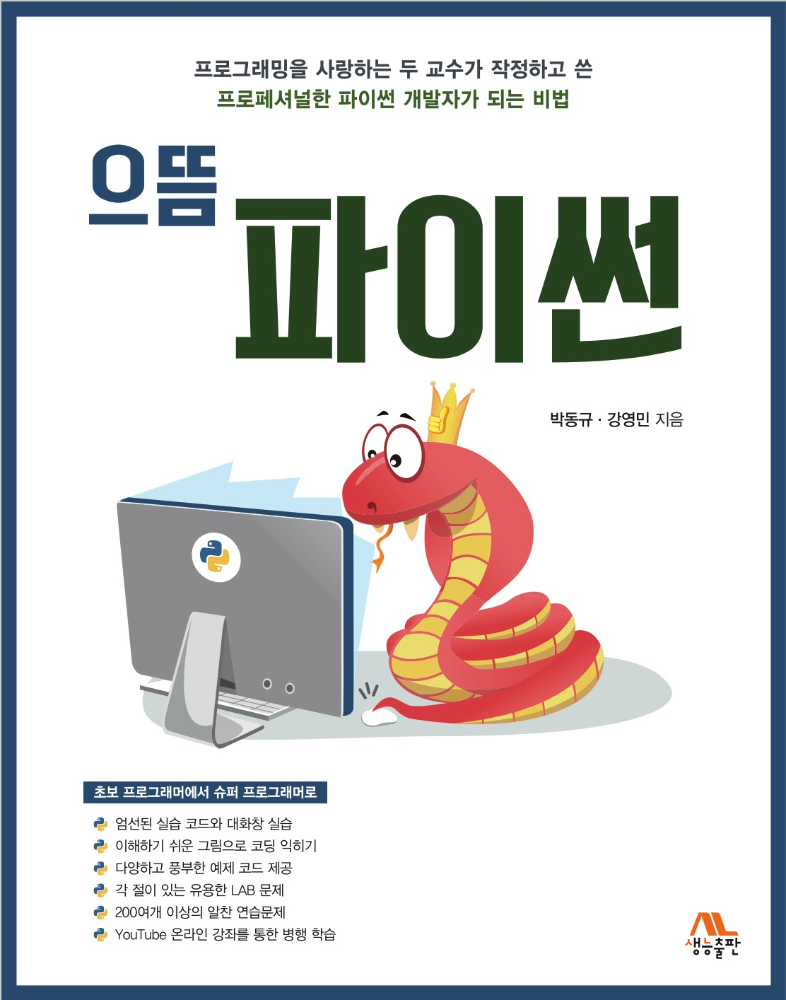

# 강의 계획서 예시

  

## 강의 교재 
- "으뜸 파이썬"(생능출판사, 2020년 출판)
- 저자 : 박동규, 강영민
- 교재의 특징 : 4차 산업혁명시대에 필요한 컴퓨팅적 사고와 문제해결 능력을 향상시키기 위한 책으로, 깊이있는 컴퓨팅 이론과 프로그래밍 코드가 제공되며, 풍부한 연습문제를 통해 실전에 필요한 코딩 실력을 향상시킬 수 있다.

## 강의 소개
- 본 강의는 파이썬 프로그래밍을 통해서 수강생들의 컴퓨팅 사고능력을 향상시키는 것을 목표로 한다.
- 기초적인 파이썬 개발도구의 설치에서부터 출력문, 제어문, 함수의 개념을 익혀서 컴퓨터를 이용한 많은 문제해결을 해 보도록 한다.
- 이를 통해서 효율적인 데이터 처리 방법과 다양한 자료형에 관하여 이해하고 컴퓨터를 이용한 문제 해결을 할 수 있다
- 또한 모듈의 활용, 기계학습을 위한 넘파이, 파일 입출력, 리스트 축약표현등 프로그래밍 기법을 익히도록 한다

## 강의 목표
- 파이썬 프로그래밍 언어를 이용하여 기본적인 문제해결을 위한 코딩을 할 수 있다.
- 다양한 데이터 처리를 위하여 파이썬의 리스트, 튜플, 딕셔너리등의 자료형 객체를 활용할 수 있다.
- 컴퓨터로 해결가능한 문제를 정의하고, 그 해결절차를 익혀서 컴퓨팅 사고능력을 향상시킨다.

## 플립드 러닝(뒤집힌 학습) 진행시
- 주차별 계획에 따라 강사의 동영상 강의 혹은, 아래“널널한 교수의 으뜸 파이썬” 동영상 강의를 미리 듣고,  각 절의 LAB 문제와 각 장의 주요 연습문제를 강사와 함께 풀어봅니다.(문제 풀이 포함 전체 47개 가량의 학습 동영상으로 구성)
- 문제를 풀면서 해결이 안될 경우 동료 학습자와 토의하며 함께 해결해 봅니다. 해결 후 강사와 함께 문제에 대하여 토의하고 더 난이도 높은 문제에 도전해 봅니다.
- 문제 해결 후 동영상 강의를 다시 한번 듣고 복습해 봅니다.
  - https://www.youtube.com/playlist?list=PL2P1Vm9k53HOflCAdyYaOx7hfBHydWNcL

# 주별 계획
## 1주 : 파이썬을 소개하는 시간
- 강의내용 안내와 강사, 교재를 소개하는 시간을 가진다.
- 파이썬 소개 및 파이썬 개발환경을 안내한다.
- 파이썬 IDLE를 설치하고 Hello World! 라는 인사를 출력해 본다.

## 2주 : 파이썬 변수와 연산자에 대해 알아보자
- 파이썬의 변수에 대해서 알아본다.
- 변수를 사용하여 얻게되는 장점을 이해한다.
- print() 함수의 사용법을 자세히 알아본다.
- 식별자란 무엇인지 알아보고, 식별자 이름을 짓는 규칙에 대해 알아본다.
- 다양한 연산자를 활용하여 계산을 수행할 수 있다.
- 파이썬의 문자열을 사용할 수 있다.
- 주석문의 개념과 사용법에 대해 알아본다.

## 3주 : 파이썬의 제어문으로 조건문, 반복문을 알아본다
- 순차적 실행과 조건문, 반복문과 같은 제어문의 차이를 이해하고 활용할 수 있다.
- 조건문의 개념과 사용법에 대해 이해한다.
- if 문과 if-else 문 등 다양한 조건문에 대해 이해한다.
- for 반복문에 대해 자세히 이해한다.
- while 반복문을 정의하고 사용하는 방법을 이해한다.
- for 문을 이용하여 작성한 반복문을 while 문으로 변경할 수 있다.
- break와 continue를 이용하여 반복문을 제어할 수 있다.

## 4주 : 함수의 개념을 익히고 함수를 통한 다양한 문제해결 기법을 익힌다
- 함수에 대해 이해하고 그 필요성을 설명할 수 있다. 
- 사용자 정의 함수를 def 문을 이용하여 정의하고 호출할 수 있다. 
- 호출되는 함수에 값을 전달하기 위하여 매개변수를 사용할 수 있다. 
- 함수의 반환문에 대해 이해하고 그 필요성을 설명할 수 있다. 
- input() 함수를 이용한 입력 방법에 대해 이해하고 사용할 수 있다. 
- format() 메소드와 플레이스홀더를 이용한 출력을 할 수 있다. 
- 여러 가지 출력서식을 사용할 수 있다. 
- 파이썬의 다양한 내장 함수를 사용할 수 있다.

## 5주 : 리스트 자료형을 익힌다
- 리스트 자료형의 개념과 그 필요성에 대해서 알아본다.
- 리스트의 기본 사용법과 연산, 기능에 대해 알아봅니다.
- iterator에 대해서 배워보고, iterator 자료형은 어떤 것이 있는지 살펴본다.
- 슬라이싱이 무엇인지 익히고 여러 가지 방법으로 리스트와 튜플, 문자열을 함께 슬라이싱 해본다.

## 6주 : 딕셔너리, 튜플, 집합 자료형을 익힌다
- 딕셔너리, 튜플, 집합 자료형 객체를 생성하고 사용하는 법에 대해서 알아본다.
- 딕셔너리와 리스트의 차이점에 대해서 알아본다.
- 튜플과 집한 데이터에 대해 이해하고 각 자료구조의 메소드와 활용 방법을 익힌다.
- 불변 시퀀스 자료형에 대해 이해하고, 이를 다루는 법을 익힌다.
- 반복가능 자료형들을 집적하여 튜플의 리스트를 만드는 방법을 이해한다.
- 리스트, 딕셔너리, 튜플, 집합형 클래스가 가진 다양한 메소드를 활용할 수 있다.

## 7주 : 모듈과 활용 1
- 모듈의 정의와 종류에 대해서 알아본다.
- 파이썬에서 제공하는 모듈을 활용하는 방법을 이해한다.
- 파이썬에서 제공하는 기본 모듈을 이용하여 강력한 기능을 활용할 수 있다.
- from ... import 구문을 이용하여 특정 클래스나 메소드를 가지고 올 수 있다.
- Python Module Index 페이지를 이용하여 원하는 모듈에 대한 정보를 알아본다.
- 시간과 날짜를 다루는 모듈을 이해하고 활용할 수 있다.
- 강력한 수학 모듈을 통해 다양하고 복잡한 연산을 수행할 수 있다.

## 8주 : 중간평가 
- 중간평가 시험을 통해서 파이썬 프로그래밍 기법을 익히고 스스로를 평가해 본다.

## 9주 : 모듈과 활용 2
- 파이썬의 random 모듈을 사용하여 임의의 수를 생성하는 기능을 활용할 수 있다.
- turtle 모듈을 이용하여 표현하고 싶은 정보를 그래픽으로 나타낼 수 있다.
- sys 모듈을 통해서 시스템의 정보를 얻을 수 있다.
- tkinter 모듈을 사용하여 윈도를 생성하고 그래픽 사용자 인터페이스를 갖춘 프로그램을 작성할 수 있다.
- 모듈이 갖고 있는 다양하고 강력한 기능을 확인할 수 있다.

## 10주 : 예외 처리의 필요성과 오류없는 코딩 기법에 대해 알아본다
- 프로그램 작성시 발생 가능한 구문 오류와 예외에 대해 알아본다. 
- 프로그램이 문법적으로 올바르더라도 발생할 수 있는 예외에 대해서 살펴본다. 
- 예외를 처리하기 위해서 try-except 문에 대해서 배워보고 직접 활용할 수 있다. 
- 파이썬에서 제공하는 예외 이외의 예외를 발생시킬 때에 사용할 수 있는 raise 문에 대해서 이해하고 활용한다. 

## 11주 : 파이썬의 파일 처리 기법을 익힌다
- 파일의 개념에 대해 이해한다. 
- 파일 입력과 출력을 위한 함수에 대해 알아보고, 이들을 이용하여 파일을 생성하고, 저장하고, 읽어 들일 수 있다. 
- 파일의 다룰 때에 사용되는 파일 입출력 모드에 대해 이해한다. 
- 파일 입출력 시 발생가능한 예외에 대하여 알아본다. 

## 12주 : 클래스와 객체지향 프로그래밍 기법을 익힌다
- 객체 지향 프로그래밍에 대해서 살펴보고 그 필요성에 대해 이해한다. 
- 객체와 클래스의 개념을 구분할 수 있다. 
- 클래스를 설계하고 객체를 생성하는 법을 이해하고 구현할 수 있다.
- 생성자의 개념을 이해하고, 이를 이용할 수 있다. 
- 캡슐화의 개념을 이해하고, 프로그램 동작의 안정성을 위해 이 개념을 적용할 수 있다. 

## 13주 : 람다함수의 개념을 익히며 리스트 축약표현을 알아본다.
- 람다 함수의 개념을 이해하고 사용법을 알아본다.
- 필터 함수와 맵 함수를 이해하고 람다 함수를 이용하여 필터링과 매핑을 수행한다.
- 람다 함수를 사용한 간결하고 강력한 코딩기법을 익힌다.
- 리스트 축약표현을 이해하고 구현할 수 있다.
- 리스트 축약표현을 이용하여 필터링과 매핑을 수행한다.
- 리스트 축약표현을 통한 문제 해결 능력을 익힌다.

## 14주 : 과학계산에 필수적인 넘파이 라이브러리를 익힌다
- 넘파이의 핵심적인 요소인 ndarray를 사용해 본다.
- ndarray와 리스트의 차이를 이해하고, 그 특성에 맞는 활용을 할 수 있다.
- 넘파이가 과학기술 분야와 머신 러닝 분야에 적합한 이유를 설명할 수 있다.
- ndarray와 선형대수 문제의 연관을 이해한다.
- 넘파이를 이용하여 다양한 행렬, 벡터 문제를 해결할 수 있다.
- 넘파이의 linalg 패키지를 이용하여 다양한 선형대수 문제를 풀 수 있다.

## 15주 : 기말평가기간
- 파이썬의 강력한 기능을 평가 시험을 통하여 익히도록 한다.

