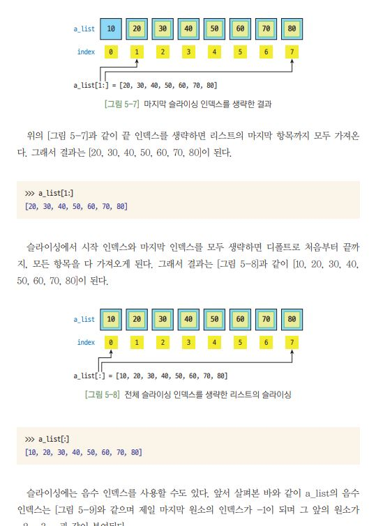
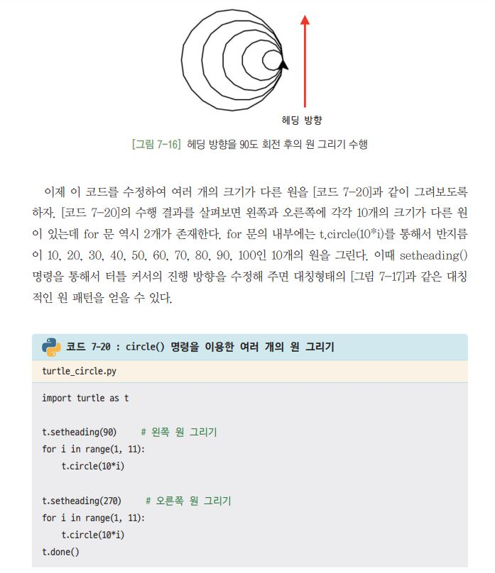
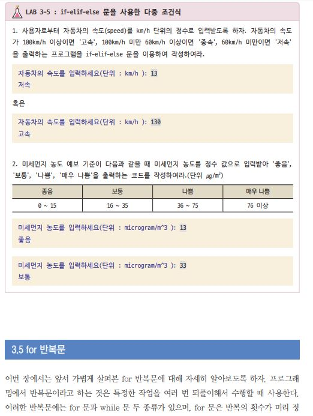
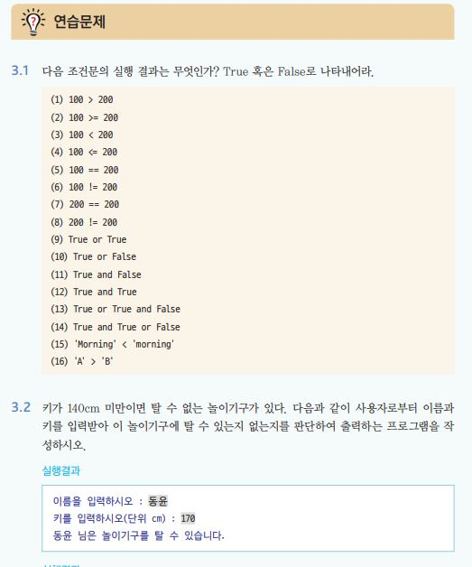

# 으뜸 파이썬 미리보기
- 다음과 같은 그림과 실습 코드를 보여줍니다

  
리스트 실습 코드의 예
  

- 터틀 그래픽을 통해 파이썬을 익힐 수 있습니다.

  
거북이 그래픽 실습 코드의 예
  

- 각 절마다 적절한 수준의 연습 문제를 제공합니다.

  
LAB 문제의 예
  

# 또한 각 장마다 고급 연습 문제를 제공합니다.
- 각 절마다 적절한 수준의 연습 문제를 제공합니다.

  
 연습문제 예시 
  

